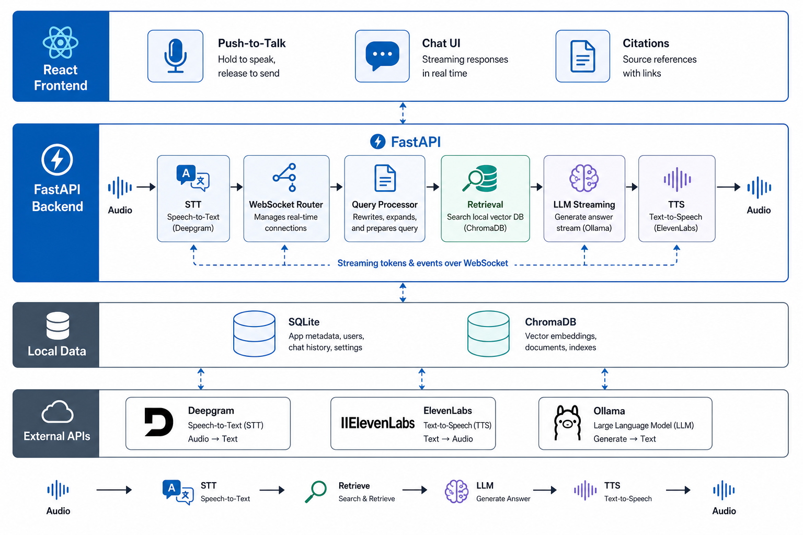
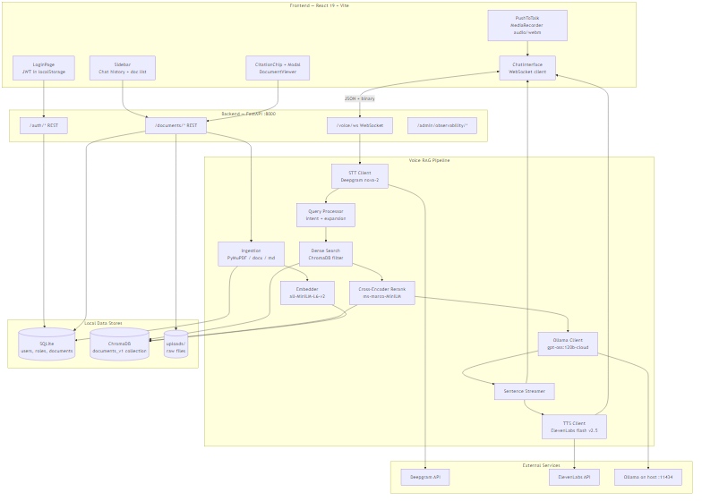
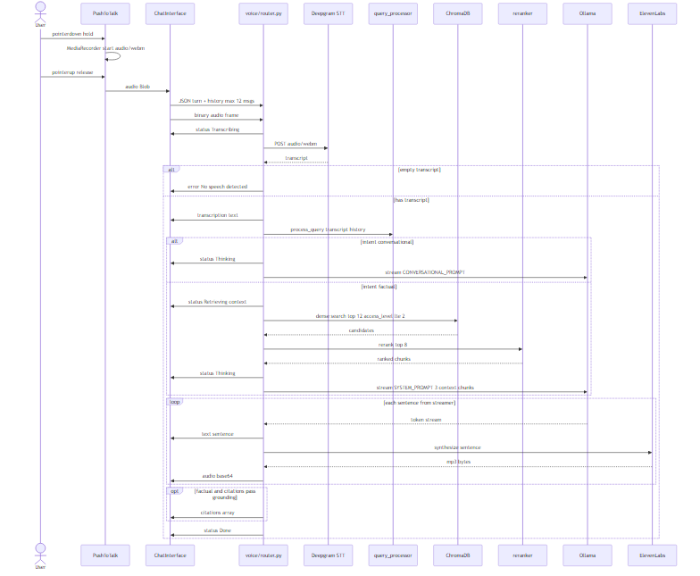
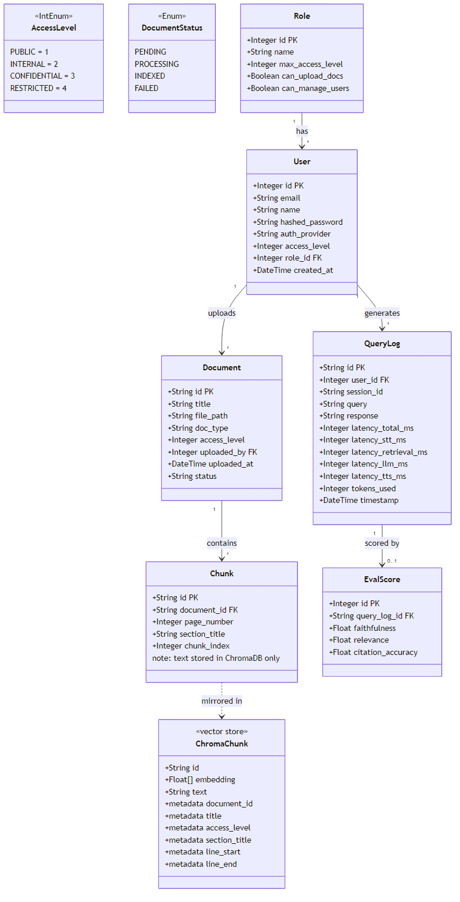
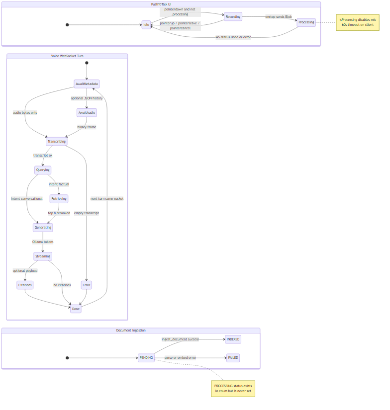
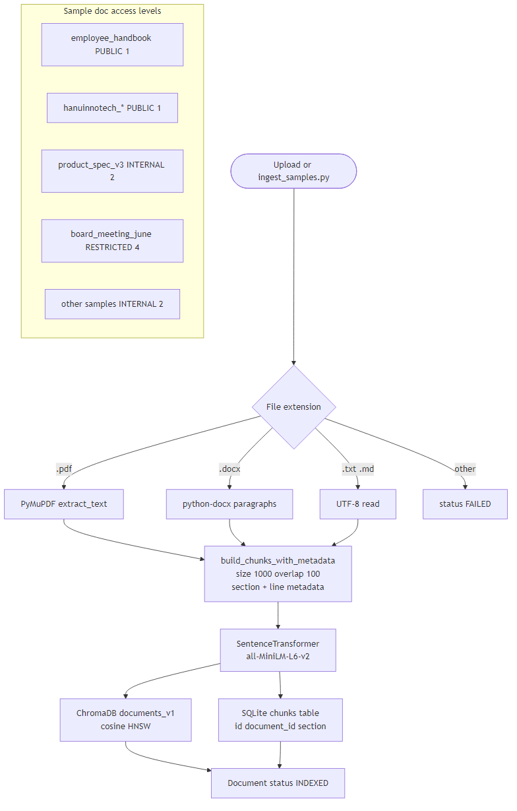
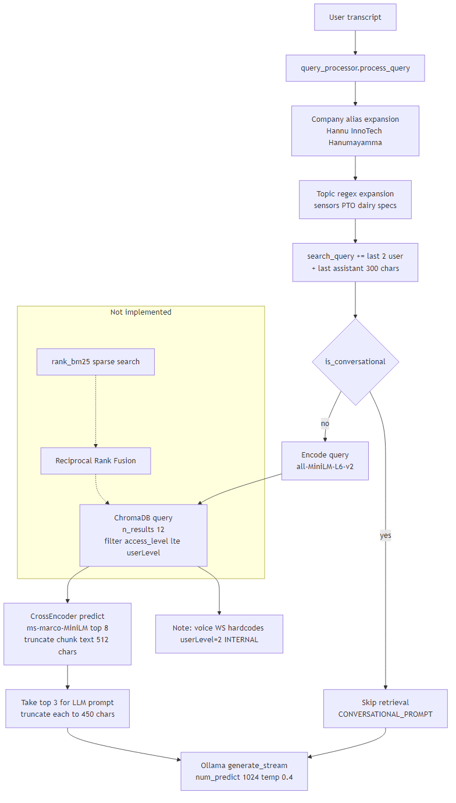
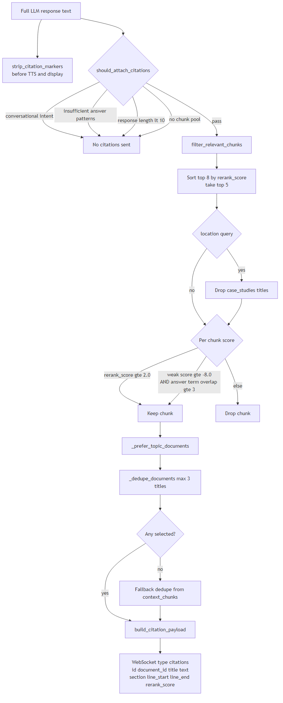
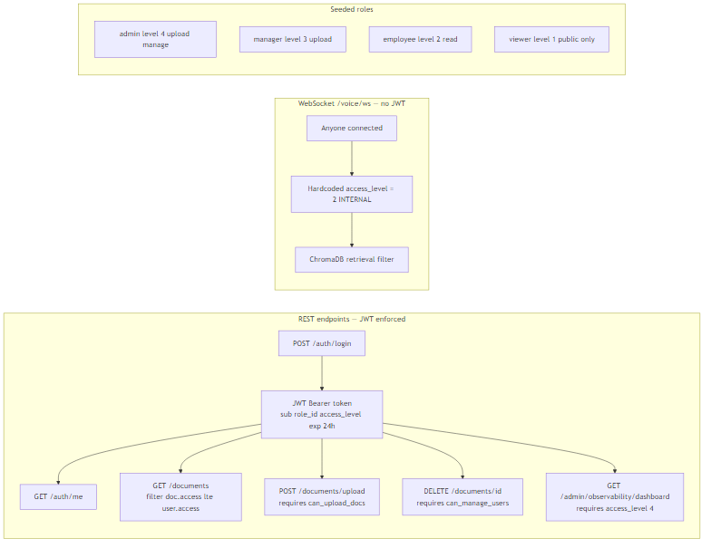
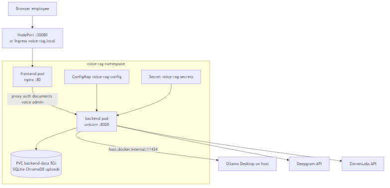

# Voice RAG Chatbot

<p align="center">
  
</p>

<p align="center">
  <strong>Internal voice-first RAG assistant</strong> — speak a question, retrieve grounded passages from company documents, receive cited answers, and hear responses streamed aloud.
</p>

<p align="center">
  <em>Proof of Concept (PoC) for Hannu InnoTech · FastAPI · React · ChromaDB · Ollama</em>
</p>

---

## Overview

This repository implements a **local, demo-ready Proof of Concept** of an employee-facing voice chatbot. Employees hold a push-to-talk button, ask a question verbally, and receive:

1. A **transcription** of their speech  
2. A **streaming text answer** grounded in internal documents  
3. **Clickable source citations** with chunk preview and full-document viewer  
4. **Sentence-level text-to-speech** audio as the answer is generated  

The PoC validates the architecture described in [`voice_chatbot_system_design.md`](./voice_chatbot_system_design.md) using a laptop-friendly stack (SQLite, ChromaDB, local embeddings, Ollama on the host) rather than the production AWS services (OpenSearch, PostgreSQL, Claude, Polly, Cognito).

| Attribute | Value |
|---|---|
| **Status** | PoC — functional demo, not production-hardened |
| **Backend** | Python 3.11, FastAPI, Uvicorn |
| **Frontend** | React 19, Vite 5, Tailwind CSS 4 |
| **Vector store** | ChromaDB (`documents_v1`, cosine HNSW) |
| **Relational DB** | SQLite via SQLAlchemy async |
| **LLM** | Ollama → `gpt-oss:120b-cloud` (host) |
| **STT** | Deepgram Nova-2 REST |
| **TTS** | ElevenLabs `eleven_flash_v2_5` |

---

## Table of contents

- [Features](#features)
- [Architecture diagrams](#architecture-diagrams)
- [System architecture](#system-architecture)
- [Voice query flow](#voice-query-flow)
- [Data model (UML)](#data-model-uml)
- [State machines](#state-machines)
- [Document ingestion](#document-ingestion)
- [Retrieval algorithm](#retrieval-algorithm)
- [Citation algorithm](#citation-algorithm)
- [Authentication & RBAC](#authentication--rbac)
- [Deployment topology](#deployment-topology)
- [Repository structure](#repository-structure)
- [Prerequisites](#prerequisites)
- [Quick start](#quick-start)
- [Configuration](#configuration)
- [Demo accounts](#demo-accounts)
- [Using the application](#using-the-application)
- [API reference](#api-reference)
- [WebSocket protocol](#websocket-protocol)
- [Frontend architecture](#frontend-architecture)
- [Utility scripts](#utility-scripts)
- [Nuances & known limitations](#nuances--known-limitations)
- [Related documentation](#related-documentation)
- [Contributing](#contributing)

---

## Features

### Implemented in this PoC

| Area | Details |
|---|---|
| **Voice input** | Hold-to-talk via `MediaRecorder` (`audio/webm`); min useful clip enforced server-side (≥ 1024 bytes for STT). |
| **Speech-to-text** | Deepgram `nova-2` with `smart_format` and domain transcript normalization (`stt_corrections.py`). |
| **Query processing** | Regex intent classification (conversational vs factual), company alias expansion, topic expansion, history-augmented search query. |
| **Retrieval** | Dense vector search in ChromaDB with `access_level <= N` metadata filter; cross-encoder reranking. |
| **Generation** | Ollama streaming chat with grounding prompt; max 3 context chunks × 450 chars each. |
| **Citations** | Post-hoc relevance scoring; WebSocket `citations` payload; chip → modal → document viewer with line highlight. |
| **TTS** | Per-sentence ElevenLabs synthesis; base64 audio chunks queued sequentially in the browser. |
| **Multi-turn chat** | Client sends last 12 turns over WebSocket; persisted in `localStorage` per user. |
| **Auth (REST)** | Email/password JWT; four seeded roles with four access levels. |
| **Documents (REST)** | List, upload (API), content view, chunk detail, delete (admin). |
| **Sample corpus** | Hannu InnoTech website docs, product spec, employee handbook, restricted board notes. |
| **Kubernetes deploy** | `./start.sh` builds images, deploys namespace `voice-rag`, seeds data. |

### Not implemented (honest scope boundary)

| Area | Current state |
|---|---|
| BM25 hybrid search + RRF | `rank-bm25` in requirements; **dense-only** in code (`hybrid_search.py`). |
| Google OAuth / corporate SSO | Config keys exist; **no OAuth routes**. |
| WebSocket JWT / per-user RBAC | **`access_level = 2` hardcoded** on `/voice/ws`. |
| Query log persistence | `QueryLog` model exists; **voice pipeline never writes logs**. |
| Admin observability UI | Backend dashboard endpoint only; **frontend button is inert**. |
| Document upload UI | `POST /documents/upload` works; **no frontend upload component**. |
| Inline LLM citations | Prompt **forbids** inline markers; sources shown separately. |
| Parent-child chunking | Flat 1000-char chunks with 100-char overlap. |
| Guardrails module | No input sanitization, PII filter, or injection classifier. |
| Automated tests | No `backend/tests/` directory. |

---

## Architecture diagrams

All diagrams are **generated from Mermaid sources** in [`docs/diagrams/`](./docs/diagrams/). Re-render with:

```bash
docs\render-diagrams.bat        # Windows
# or
npx @mermaid-js/mermaid-cli -i docs/diagrams/FILE.mmd -o docs/images/FILE.png -b white
```

| # | Diagram | Image |
|---|---------|-------|
| 0 | Overview (illustrated) | [`docs/images/00-architecture-overview.png`](./docs/images/00-architecture-overview.png) |
| 1 | System component architecture | [`docs/images/01-system-architecture.png`](./docs/images/01-system-architecture.png) |
| 2 | Voice query sequence | [`docs/images/02-voice-query-sequence.png`](./docs/images/02-voice-query-sequence.png) |
| 3 | UML class diagram | [`docs/images/03-uml-class-diagram.png`](./docs/images/03-uml-class-diagram.png) |
| 4 | State diagrams (PTT, voice turn, ingestion) | [`docs/images/04-state-diagrams.png`](./docs/images/04-state-diagrams.png) |
| 5 | Document ingestion flow | [`docs/images/05-ingestion-flow.png`](./docs/images/05-ingestion-flow.png) |
| 6 | Retrieval algorithm | [`docs/images/06-retrieval-algorithm.png`](./docs/images/06-retrieval-algorithm.png) |
| 7 | Citation selection algorithm | [`docs/images/07-citation-algorithm.png`](./docs/images/07-citation-algorithm.png) |
| 8 | Kubernetes deployment | [`docs/images/08-deployment.png`](./docs/images/08-deployment.png) |
| 9 | Auth & RBAC (REST vs WebSocket) | [`docs/images/09-auth-rbac.png`](./docs/images/09-auth-rbac.png) |

---

## System architecture

<p align="center">
  
</p>

The system splits into four layers:

1. **React SPA** — push-to-talk, WebSocket client, citation UI, chat history in `localStorage`.  
2. **FastAPI backend** — REST for auth/documents; WebSocket for the voice RAG pipeline.  
3. **Local data** — SQLite (users, roles, document metadata, chunk IDs) and ChromaDB (embeddings + chunk text).  
4. **External services** — Deepgram STT, ElevenLabs TTS, Ollama LLM on the host machine.

**Key file:** [`backend/voice/router.py`](./backend/voice/router.py) orchestrates STT → query processing → retrieval → LLM streaming → sentence TTS.

---

## Voice query flow

<p align="center">
  
</p>

### Pipeline constants (exact values from code)

| Stage | Constant | Value | Source |
|---|---|---|---|
| History (client → server) | max turns | 12 | `ChatInterface.jsx`, `query_processor.py` |
| History content max | chars per message | 1000 | `query_processor.py` |
| STT min audio | bytes | 1024 | `stt_client.py` |
| Chroma retrieval | `n_results` | 12 | `voice/router.py` |
| Reranker output | `top_k` | 8 | `voice/router.py` |
| LLM context chunks | `CONTEXT_CHUNK_LIMIT` | 3 | `prompt_templates.py` |
| Context truncation | `MAX_CHUNK_CHARS` | 450 | `prompt_templates.py` |
| Reranker input truncate | chars | 512 | `reranker.py` |
| LLM history | `MAX_LLM_HISTORY` | 12 | `llm_client.py` |
| LLM options | `num_predict` / `temperature` | 1024 / 0.4 | `llm_client.py` |
| Sentence streamer early flush | chars | 48 (min clause 24) | `streaming.py` |
| WebSocket retrieval filter | `access_level` | **2 (INTERNAL, hardcoded)** | `voice/router.py:205` |

---

## Data model (UML)

<p align="center">
  
</p>

### Access levels (`auth/models.py`)

| Enum | Integer | Meaning |
|---|---|---|
| `PUBLIC` | 1 | Public-facing internal docs |
| `INTERNAL` | 2 | Default employee clearance |
| `CONFIDENTIAL` | 3 | Manager-level docs |
| `RESTRICTED` | 4 | Admin / board-level docs |

### Seeded roles (`seed_data.py`)

| Role | Max level | Upload docs | Manage users |
|---|---|---|---|
| `admin` | RESTRICTED (4) | Yes | Yes |
| `manager` | CONFIDENTIAL (3) | Yes | No |
| `employee` | INTERNAL (2) | No | No |
| `viewer` | PUBLIC (1) | No | No |

### Important nuance: chunk storage split

- **SQLite `chunks` table** stores `id`, `document_id`, `section_title`, `chunk_index`, and `page_number` (actually **`line_start`** from ingestion — not a PDF page number).  
- **Chunk text and embeddings** live only in **ChromaDB** collection `documents_v1`.  
- **`QueryLog` / `EvalScore`** tables exist but are **not populated** by the live voice pipeline.

---

## State machines

<p align="center">
  
</p>

### PushToTalk UI states (`PushToTalk.jsx`)

| State | Trigger | UI |
|---|---|---|
| **Idle** | Default | Blue mic button, “Hold to speak” |
| **Recording** | `pointerdown` (not processing) | Red button, Square icon |
| **Processing** | `isProcessing` prop true | Spinner, mic disabled |

Recording uses `getUserMedia({ audio: true })` and `MediaRecorder({ mimeType: 'audio/webm' })`.

### Document ingestion states (`documents/models.py`)

| Status | When set |
|---|---|
| `PENDING` | Document created (default) |
| `INDEXED` | `ingest_document` succeeds |
| `FAILED` | Parse/embed error |
| `PROCESSING` | **Defined but never assigned in code** |

---

## Document ingestion

<p align="center">
  
</p>

| Parameter | Value |
|---|---|
| Chunk size | 1000 characters |
| Chunk overlap | 100 characters |
| Embedding model | `all-MiniLM-L6-v2` (384-dim) |
| Supported formats | `.pdf`, `.docx`, `.txt`, `.md` |
| Chroma collection | `documents_v1` (cosine space) |

**Sample document access levels** (`ingest_samples.py`):

| File pattern | Access level |
|---|---|
| `employee_handbook.md` | PUBLIC (1) |
| `hanuinnotech_*.md` | PUBLIC (1) |
| `product_spec_v3.md` | INTERNAL (2) |
| `board_meeting_june.md` | RESTRICTED (4) |
| All other `.md` in `sample_docs/` | INTERNAL (2) |

Files prefixed with `_` (e.g. `_scrape_raw/`) are **skipped** during ingestion.

---

## Retrieval algorithm

<p align="center">
  
</p>

### Intent classification (`query_processor.py`)

1. Empty query → not conversational.  
2. Strip punctuation; if length **> 80** → factual path.  
3. Match conversational regex (greetings, thanks, bye, “who are you”) → **conversational** (skip retrieval).  
4. Match factual hint words (who/when/sensor/dairy/policy/…) → **factual**.  
5. Short ambiguous utterances → default **conversational**.

### Query expansion (factual path)

- **Company aliases:** “Hanu InnoTech”, “Hanumayamma”, STT variants → expanded company string.  
- **Topic regex:** sensors, PTO/vacation, locations, dairy/cattle, specifications.  
- **History:** `search_query` appends last 2 user turns + last assistant turn (300 chars).

### Dense search (not hybrid)

```python
# retrieval/hybrid_search.py — name is aspirational; implementation is dense-only
collection.query(
    query_embeddings=[embedding],
    n_results=12,
    where={"access_level": {"$lte": access_level}}
)
```

`rank-bm25` is listed in `requirements.txt` but **not called anywhere**.

---

## Citation algorithm

<p align="center">
  
</p>

Citations are **not** generated inline by the LLM. The system prompt explicitly forbids citation markers; sources are attached post-generation.

| Threshold | Value | Purpose |
|---|---|---|
| `MIN_CITATION_RERANK_SCORE` | 2.0 | Strong relevance |
| `MIN_WEAK_CITATION_SCORE` | -8.0 | Weak score + grounding fallback |
| `MIN_ANSWER_TERM_OVERLAP` | 3 | Term overlap with answer |
| Max unique document titles | 3 | After deduplication |

**Insufficient-answer patterns** (no citations attached): “don't have enough information”, “cannot answer”, response length < 10 chars, conversational intent.

Citation payload fields: `id`, `document_id`, `title`, `text`, `section_title`, `chunk_index`, `line_start`, `line_end`, `rerank_score`.

---

## Authentication & RBAC

<p align="center">
  
</p>

### REST API (JWT enforced)

- Token issued at `POST /auth/login` with payload `{ sub, role_id, access_level, exp }`.  
- HS256 signing; default expiry **1440 minutes (24 h)**.  
- Document endpoints filter by `document.access_level <= user.access_level`.  
- Upload requires `can_upload_docs`; delete requires `can_manage_users` (admin only).

### WebSocket (JWT **not** enforced)

```python
# backend/voice/router.py
access_level = 2  # INTERNAL — fixed for all voice queries
```

**Implication:** Voice RAG always retrieves PUBLIC + INTERNAL documents only, regardless of logged-in user. CONFIDENTIAL and RESTRICTED content is invisible on the voice path even when logged in as admin.

---

## Deployment topology

<p align="center">
  
</p>

| Resource | Detail |
|---|---|
| Namespace | `voice-rag` |
| Backend image | `voice-rag-backend:latest` — port 8000, 2–4 Gi RAM |
| Frontend image | `voice-rag-frontend:latest` — nginx :80 |
| NodePort | **30080** → frontend |
| Ingress host | `voice-rag.local` (optional, nginx IngressClass) |
| PVC | `backend-data` — 5 Gi (`/app/data`) |
| Ollama URL (K8s) | `http://host.docker.internal:11434` |
| SQLite path (K8s) | `sqlite+aiosqlite:////app/data/sql_app.db` |
| Chroma path (K8s) | `/app/data/chroma_db` |

Ollama runs **on the host**, not inside Kubernetes. The backend pod reaches it via `host.docker.internal`.

---

## Repository structure

```
hannuinnotech/
├── README.md                         # This file
├── voice_chatbot_system_design.md    # Production target architecture
├── implementation_plan.md            # Original PoC plan
├── start.sh / stop.sh                # Kubernetes lifecycle scripts
│
├── docs/
│   ├── diagrams/                     # Mermaid source (.mmd)
│   ├── images/                       # Rendered PNG diagrams
│   └── render-diagrams.bat           # Re-render all diagrams (Windows)
│
├── backend/
│   ├── main.py                       # FastAPI app, router registration
│   ├── config.py                     # Pydantic settings
│   ├── database.py                   # Async SQLAlchemy engine
│   ├── requirements.txt
│   ├── Dockerfile
│   │
│   ├── auth/                         # JWT, User, Role models
│   ├── documents/                    # Upload, ingestion, chunking
│   ├── retrieval/                    # ChromaDB, query processor, reranker
│   ├── generation/                   # Ollama client, prompts, citations
│   ├── voice/                        # STT, TTS, WebSocket router
│   ├── observability/                # QueryLog models (not wired to voice)
│   │
│   ├── sample_docs/                  # Demo corpus
│   ├── seed_data.py
│   ├── create_samples.py
│   └── ingest_samples.py
│
├── frontend/
│   ├── src/
│   │   ├── components/               # ChatInterface, PushToTalk, citations…
│   │   ├── context/                  # AuthContext, ChatContext
│   │   └── utils/                    # api.js, citations.js
│   ├── nginx.conf                    # Reverse proxy (K8s frontend pod)
│   └── Dockerfile
│
└── k8s/                              # Kubernetes manifests
    ├── namespace.yaml
    ├── configmap.yaml
    ├── secret.example.yaml
    ├── backend-deployment.yaml
    ├── backend-pvc.yaml
    ├── frontend-deployment.yaml
    ├── frontend-service.yaml
    └── ingress.yaml
```

---

## Prerequisites

| Requirement | Version / notes |
|---|---|
| **Docker** | Build backend and frontend images |
| **Kubernetes** | Docker Desktop K8s, Minikube, Kind, etc. |
| **kubectl** | Configured for your cluster |
| **Ollama Desktop** | `gpt-oss:120b-cloud` on the host at `:11434` |
| **Deepgram API key** | [console.deepgram.com](https://console.deepgram.com) |
| **ElevenLabs API key** | [elevenlabs.io](https://elevenlabs.io) |
| **Bash** | Git Bash or WSL on Windows for `start.sh` |

---

## Quick start

The app is **deployed only via Kubernetes** (`./start.sh`). There is no supported direct `uvicorn` / Vite dev-server workflow.

```bash
./start.sh    # first run creates k8s/secret.yaml — fill in keys, run again
```

| Access | URL |
|---|---|
| **App (NodePort)** | http://localhost:30080 |
| **Ingress** (optional) | http://voice-rag.local — add `127.0.0.1 voice-rag.local` to hosts |
| **Port-forward fallback** | `kubectl port-forward -n voice-rag svc/frontend 8080:80` → http://localhost:8080 |
| **Backend health** | `kubectl port-forward -n voice-rag svc/backend 8000:8000` → http://localhost:8000/health |

```bash
./stop.sh     # tears down namespace (deletes persistent data)
```

After code changes, re-run `./start.sh` to rebuild images and roll out.

---

## Configuration

Configuration is injected into the backend pod via **`k8s/secret.example.yaml`** (secrets) and **`k8s/configmap.yaml`** (non-secrets). On first run, `./start.sh` copies the secret example to `k8s/secret.yaml` (gitignored) for you to edit.

### Secrets — `k8s/secret.yaml` (from `secret.example.yaml`)

| Variable | Description |
|---|---|
| `DEEPGRAM_API_KEY` | Empty → simulated STT transcript |
| `ELEVENLABS_API_KEY` | Empty → text-only (no audio) |
| `ELEVENLABS_VOICE_ID` | Default `hpp4J3VqNfWAUOO0d1Us` |
| `JWT_SECRET` | HS256 signing key — **change from default** |
| `GOOGLE_CLIENT_ID` / `GOOGLE_CLIENT_SECRET` | Reserved; OAuth not implemented |

### ConfigMap — `k8s/configmap.yaml`

| Variable | K8s value | Description |
|---|---|---|
| `OLLAMA_BASE_URL` | `http://host.docker.internal:11434` | Ollama on host (Minikube: use `host.minikube.internal`) |
| `OLLAMA_MODEL` | `gpt-oss:120b-cloud` | Ollama chat model |
| `DATABASE_URL` | `sqlite+aiosqlite:////app/data/sql_app.db` | SQLite on PVC |
| `CHROMA_PERSIST_DIRECTORY` | `/app/data/chroma_db` | ChromaDB on PVC |

Other settings (`ACCESS_TOKEN_EXPIRE_MINUTES`, etc.) use defaults from [`backend/config.py`](./backend/config.py) unless added to the ConfigMap.

---

## Demo accounts

| Email | Password | Role | Access level |
|---|---|---|---|
| `admin@demo.com` | `admin123` | admin | RESTRICTED (4) |
| `manager@demo.com` | `manager123` | manager | CONFIDENTIAL (3) |
| `employee@demo.com` | `employee123` | employee | INTERNAL (2) |
| `viewer@demo.com` | `viewer123` | viewer | PUBLIC (1) |

---

## Using the application

1. Sign in with a demo account.  
2. **Hold** the microphone button, speak (2–5 seconds), **release**.  
3. Read the transcription, streamed answer, and **Sources** chips.  
4. Click a citation → preview chunk → **Open full document** with line highlight.  
5. Ask follow-ups in the same chat — history is sent automatically.  
6. Use the sidebar to switch chats or open documents from the corpus list.

---

## API reference

| Method | Path | Auth | Description |
|---|---|---|---|
| `GET` | `/health` | — | `{"status":"ok"}` |
| `POST` | `/auth/register` | — | Register (defaults to employee role) |
| `POST` | `/auth/login` | — | Returns `{ access_token, token_type }` |
| `GET` | `/auth/me` | Bearer | Current user |
| `GET` | `/documents/` | Bearer | List accessible documents |
| `POST` | `/documents/upload` | Bearer + upload permission | Multipart: `file`, `access_level` |
| `GET` | `/documents/{id}/content` | Bearer | Full document text |
| `GET` | `/documents/chunks/{id}` | Bearer | Chunk detail for citations |
| `DELETE` | `/documents/{id}` | Bearer + admin | Delete doc + vectors |
| `GET` | `/admin/observability/dashboard` | Bearer level ≥ 4 | Query stats (empty until wired) |
| `WS` | `/voice/ws` | **None** | Voice pipeline |

---

## WebSocket protocol

**Endpoint:** `/voice/ws`

### Client → server (each turn)

1. Text frame (optional):
   ```json
   { "type": "turn", "history": [{ "role": "user|assistant", "content": "..." }] }
   ```
2. Binary frame: WebM audio blob.

### Server → client

| `type` | `data` |
|---|---|
| `status` | `"Transcribing..."` · `"Retrieving context..."` · `"Thinking..."` · `"Done"` |
| `transcription` | STT text |
| `text` | Streamed answer sentence |
| `citations` | Array of citation objects |
| `audio` | Base64 TTS chunk |
| `error` | Error string |

Client processing timeout: **60 seconds** (`ChatInterface.jsx`). Reconnect delay on disconnect: **1.5 seconds**.

---

## Frontend architecture

| Component | Responsibility |
|---|---|
| `App.jsx` | Routes: `/login`, `/` (protected) |
| `AuthContext.jsx` | JWT in `localStorage` key `token`; hydrates via `/auth/me` |
| `ChatContext.jsx` | Sessions in `localStorage` key `voice-rag-chats-{userId}` |
| `ChatInterface.jsx` | WebSocket, message rendering, audio queue |
| `PushToTalk.jsx` | MediaRecorder hold-to-talk |
| `CitationChip.jsx` / `CitationModal.jsx` | Source preview flow |
| `DocumentViewer.jsx` | Full doc with line-based highlight scroll |
| `Sidebar.jsx` | Chat list, document list, logout |

**Production nginx** (`frontend/nginx.conf`, used in the K8s frontend pod): proxies `/auth`, `/documents`, `/voice`, `/admin`, `/health` to `http://backend:8000`; 300 s read/send timeout for WebSocket.

---

## Utility scripts

| Script | Command | Purpose |
|---|---|---|
| `seed_data.py` | `python seed_data.py` | Create roles + demo users |
| `create_samples.py` | `python create_samples.py` | Write core sample MD + run website scraper |
| `ingest_samples.py` | `python ingest_samples.py [--reindex]` | Index `sample_docs/*.md` into ChromaDB |
| `cleanup_duplicate_documents.py` | `python cleanup_duplicate_documents.py` | Remove duplicate docs by title |
| `scrape_hanuinnotech_website.py` | Called by `create_samples.py` | Crawl hanuinnotech.com → consolidated MD |

---

## Nuances & known limitations

This section documents behaviors that are easy to misread from the design doc alone.

| # | Nuance |
|---|---|
| 1 | **`perform_hybrid_search` is dense-only.** BM25 + RRF from the design doc are not implemented. |
| 2 | **Voice WebSocket ignores JWT** and hardcodes `access_level = 2`. RBAC demos must use REST document APIs, not voice, for level 3/4 content. |
| 3 | **Citations are post-hoc**, not inline LLM markers. The prompt forbids `[Source: …]` in the spoken answer. |
| 4 | **`Chunk.page_number` stores line numbers**, not PDF page numbers. The UI shows line ranges. |
| 5 | **`DocumentStatus.PROCESSING` is never set** — documents jump PENDING → INDEXED or FAILED. |
| 6 | **`QueryLog` is never written** during voice turns — the observability dashboard always shows zero queries. |
| 7 | **Upload ingestion passes the request-scoped DB session** to `BackgroundTasks` — may fail under load (session closed). |
| 8 | **Delete endpoint** requires `CONFIDENTIAL` level gate but checks `can_manage_users` — only admin can delete. |
| 9 | **Two separate `SentenceTransformer` instances** load in `ingestion.py` and `hybrid_search.py` (duplicate memory). |
| 10 | **CORS** allows `origins=["*"]` with `allow_credentials=True` — invalid in strict browsers. |
| 11 | **Default JWT secret** is in source (`config.py`) — must be overridden for shared environments. |
| 12 | **Google OAuth config keys** are placeholders — no OAuth implementation. |
| 13 | **`evaluator.py` citation check** looks for `[chunk_id]` in response text, but citations are stripped before logging would occur — evaluator is incompatible with current architecture. |
| 14 | **ElevenLabs free tier** (~10K chars/month) exhausts quickly; TTS fails silently (`b""`) and answers remain text-only. |
| 15 | **Ollama `think=True`** is enabled; only `message.content` tokens are streamed (reasoning tokens discarded). |

---

## Related documentation

| Document | Description |
|---|---|
| [`voice_chatbot_system_design.md`](./voice_chatbot_system_design.md) | Production architecture, NFRs, security, rollout |
| [`implementation_plan.md`](./implementation_plan.md) | Original PoC scope |
| [`AGENTS.md`](./AGENTS.md) | Frontend conventions (Baseline 2024) |
| [`docs/diagrams/`](./docs/diagrams/) | Mermaid diagram sources (editable) |

---

## Contributing

1. Fork and branch from `main`.  
2. Match existing code style; see [`AGENTS.md`](./AGENTS.md) for frontend rules.  
3. Keep diffs focused — this is a PoC.  
4. Update this README and diagrams in `docs/` if you change architecture or constants.  
5. Re-render diagrams: `docs\render-diagrams.bat`.  
6. Test via `./start.sh` (rebuild + rollout) with Ollama running on the host before opening a PR.

**High-impact gaps for contributors:** WebSocket JWT + per-user RBAC, BM25 hybrid search, QueryLog wiring, admin UI, document upload UI.

---

## License

No license file is included. Contact the repository owner before redistribution or commercial use.
